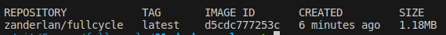

# Desafio 1: Docker + Golang

## Sobre o Desafio

O objetivo deste desafio é criar uma imagem Docker que, ao ser executada, exiba a mensagem "Full Cycle Rocks!!". Além disso, a imagem deve ser baseada em Go e ter menos de 2MB de tamanho.



[Imagem no Docker Hub](https://hub.docker.com/r/zanderlan/fullcycle)

## Estrutura do Projeto

A estrutura do projeto é a seguinte:

```
/
├── golang/
│   ├── Dockerfile
│   └── server.go
└── docker-compose.yml
```

#### Descrição dos Arquivos

- `golang/Dockerfile`: Define como a aplicação Go é construída e empacotada em uma imagem Docker.
- `golang/server.go`: Um simples programa em Go que imprime "Full Cycle Rocks!!".
- `docker-compose.yml`: Arquivo para executar a aplicação em um ambiente Dockerizado.

## Como Executar

Siga os passos abaixo para construir e executar o projeto:

**1. Construir a Imagem Docker**

```bash
docker build -t <seu-user>/fullcycle ./golang
```

Substitua <seu-user> pelo seu nome de usuário no Docker Hub.

**2. Upload da Imagem para o Docker Hub**

```bash
docker push <seu-user>/fullcycle
```

**3. Executar Localmente**

Utilizando Docker Compose:

```bash
docker-compose up
```

Ou diretamente com Docker:

```bash
docker run <seu-user>/fullcycle
```
